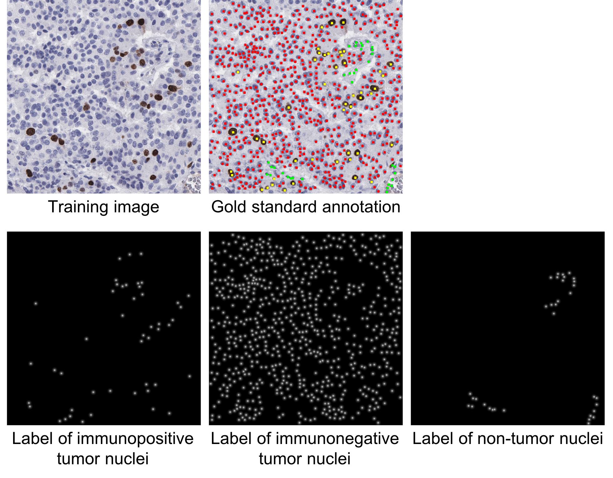
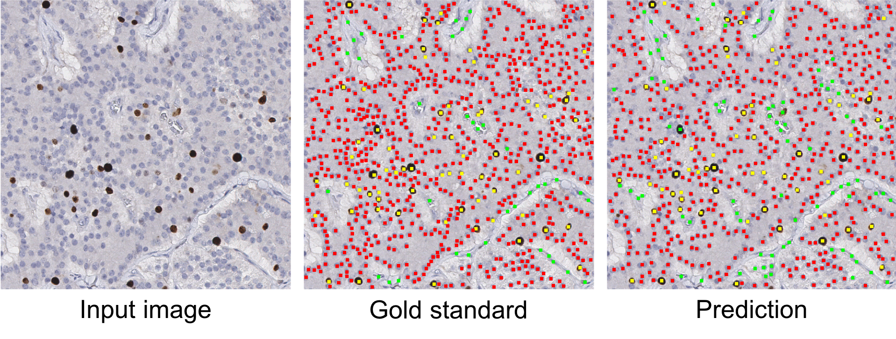

# KiNet
This code is used to locate and classify individual cells or nuclei in histologic images. The code is implemented with PyTorch (version 0.4.1, https://pytorch.org/) on a Ubuntu Linux machine.

*Some codes are based on this following code repository:\
Hoffman et al. CyCADA: Cycle-Consistent Adversarial Domain Adaptation. ICML 2018. https://github.com/jhoffman/cycada_release

**Training:** The input is RGB images and corresponding labels (please below an example training image and its label). The labels are K proximity maps (here K=3), each of which corresponds one type of cell/nucleus. Given gold standard annotation of each training image, the labels for immunopositive tumor nuclei, immunonegative tumor nuclei and non-tumor nuclei are generated using Equation (1) in the paper [1].

 
 
 

**Testing:** The input is RGB images. The output is predicted cells/nuclei and category labels, stored in .mat files and also overlaid on RGB images (as shown in the "Prediction" column in the figure above).

 
 
 

**Usage (Linux command line):** \
Model training: &nbsp; ./train_fcn_cell_class.sh \
Model inference/prediction: &nbsp; ./eval_fcn_cell_class.sh  

   
Relevant References:\
[1] Xing et al. Pixel-to-pixel Learning with Weak Supervision for Single-stage Nucleus Recognition in Ki67 Images. IEEE Transactions on Biomedical Engineering, 2019.

[2] Zhang et al. Generative Adversarial Domain Adaptation for Nucleus Quantification in Images of Tissue Immunohistochemically Stained for Ki-67, JCO Clinical Cancer Informatics, 2020.
