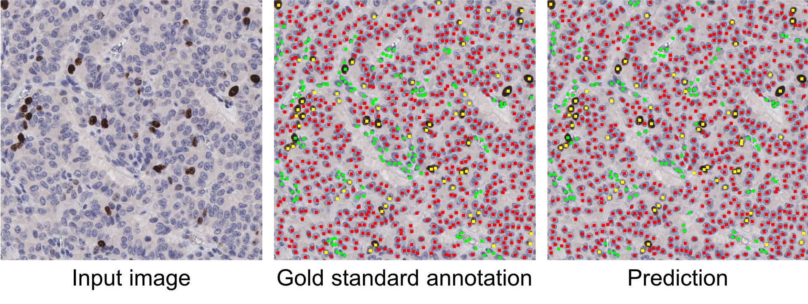

# KiNet
This code is used to locate and classify individual cells or nuclei in histologic images.

*Some codes are based on this following code repository:\
Hoffman et al. CyCADA: Cycle-Consistent Adversarial Domain Adaptation. ICML 2018. https://github.com/jhoffman/cycada_release

Training: The input is RGB images and corresponding labels. The labels are K proximity maps, each of which corresponds one type of cell/nucleus.

Testing: The input is RGB images. The output is predicted cells/nuclei and category labels, stored in .mat files.

Usage:\
Training: ./train_fcn_cell_class.sh \
Inference: ./eval_fcn_cell_class.sh

Relevant References:\
[1] Zhang et al. Generative Adversarial Domain Adaptation for Nucleus Quantification in Images of Tissue Immunohistochemically Stained for Ki-67, JCO Clinical Cancer Informatics, 2020.

[2] Xing et al. Pixel-to-pixel Learning with Weak Supervision for Single-stage Nucleus Recognition in Ki67 Images. IEEE Transactions on Biomedical Engineering, 2019.
